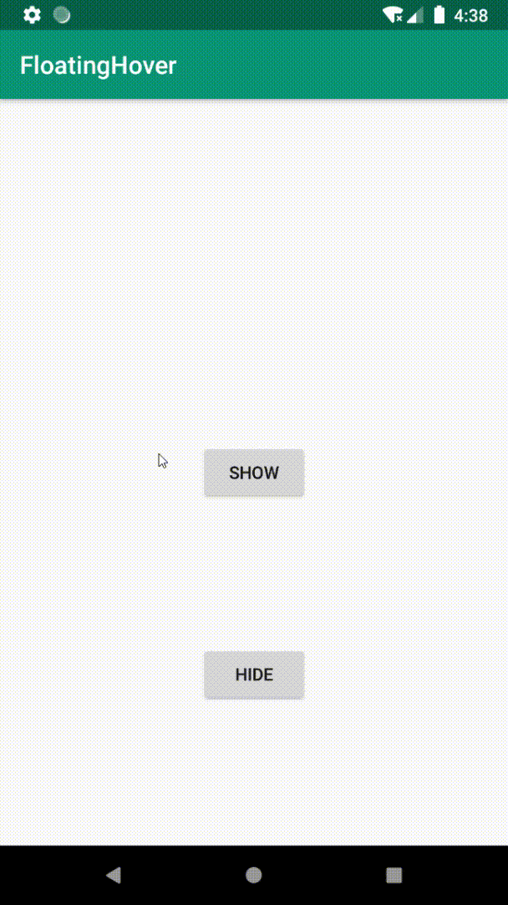

# FloatingHover
Floating hover like google translate "Tap to translate"

# Example



# Getting Start
```
implementation 'moe.tlaster:floatinghover:1.0.1'
```

Create a layout file, for example:
``` xml
<moe.tlaster.floatinghover.FloatingView
        xmlns:android="http://schemas.android.com/apk/res/android"
        xmlns:app="http://schemas.android.com/apk/res-auto"
        android:layout_width="match_parent"
        android:layout_height="match_parent"
        android:focusable="false">
    <ImageView
            android:elevation="8dp"
            app:layout_constraintStart_toStartOf="parent"
            app:layout_constraintTop_toTopOf="parent"
            android:src="@mipmap/ic_launcher_round"
            android:layout_width="wrap_content"
            android:layout_height="wrap_content"/>
    <TextView
            android:layout_alignParentEnd="true"
            android:layout_alignParentStart="true"
            android:layout_centerInParent="true"
            android:padding="16dp"
            android:gravity="center"
            android:layout_margin="16dp"
            android:background="@android:color/white"
            android:id="@+id/text"
            android:text="Hello World!"
            android:layout_width="wrap_content"
            android:layout_height="wrap_content"/>
</moe.tlaster.floatinghover.FloatingView>
```

Create a floating controller
``` kotlin
val controller = FloatingController(this, R.layout.hover_view)
```

Show the floating hover
``` kotlin
controller.show()
```
